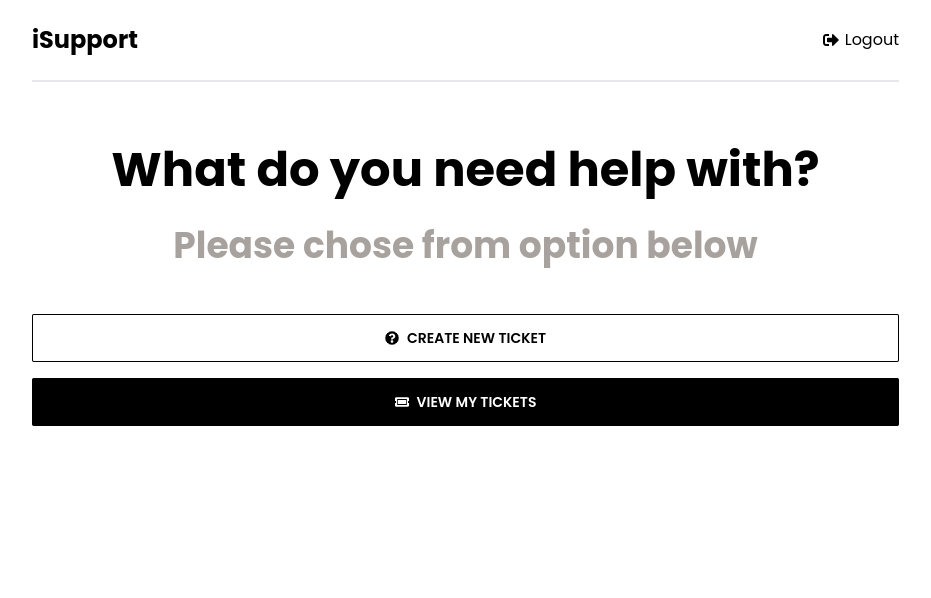
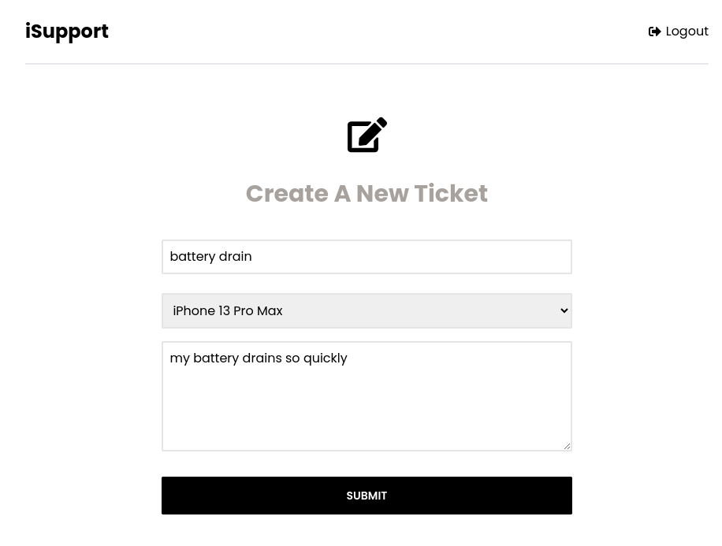
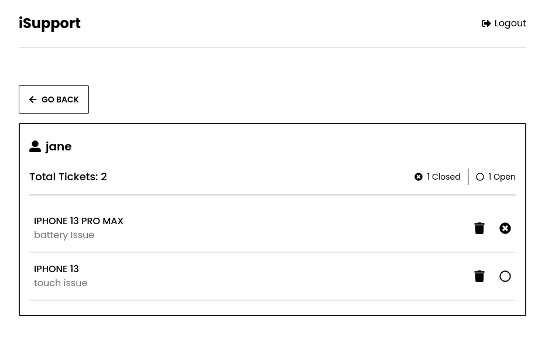
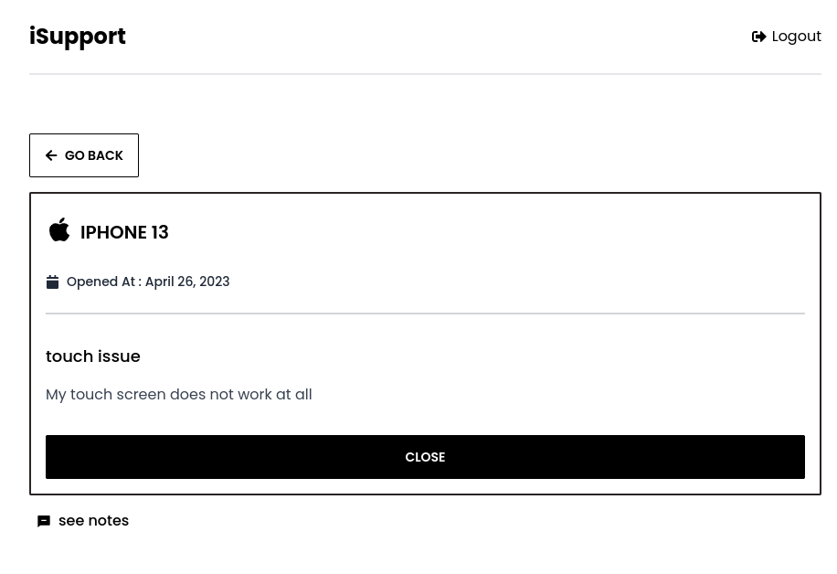

# Votey

Apple Ticket Support App

# Description

I have developed a sophisticated and highly responsive ticket support application for Apple devices. The application incorporates robust signup and login functionalities, ensuring secure and authenticated access through the implementation of the JWT protocol. This application enables users to effortlessly create and manage support tickets while offering seamless communication with customer service team through an integrated chat feature.

## Demo

https://isupport-frontend.vercel.app/

## Screenshots







## Tech Stack

**Javascript, Express, MongoDB, Mongoose, React, React-Router-Dom, Tailwind, DaisyUI, React-hook-form, React-Redux**

**DB:** MongoDB Atlas [MongoAtlas](https://www.mongodb.com/cloud/atlas)

## Run Locally

Clone the project

```bash
  git clone https://github.com/alireza-constantin/roundest-poki
```

Go to the project directory

```bash
  cd isupport-frontend
```

Install dependencies

```bash
  npm install
```

Clone the Project Backend [iSupport-backend](https://github.com/alireza-constantin/isupport-backend)

```bash
    git clone https://github.com/alireza-constantin/isupport-backend.git
```

## Create .env file in backend project

then enter your database url to these variable in .env file

```code
    MONGO_URI=
    JWT_ACCESS_SECRET=
    JWT_REFRESH_SECRET=
```

Start the development server from backend and frontend

```bash
# frontend
  npm run start
# backend
# for dev server you need to install nodemon 
  npm run dev
```

## Deploy on Vercel

The easiest way to deploy your Next.js app is to use the [Vercel Platform](https://vercel.com/new?utm_medium=default-template&filter=next.js&utm_source=create-next-app&utm_campaign=create-next-app-readme) from the creators of Next.js.

Check out our [Next.js deployment documentation](https://nextjs.org/docs/deployment) for more details.